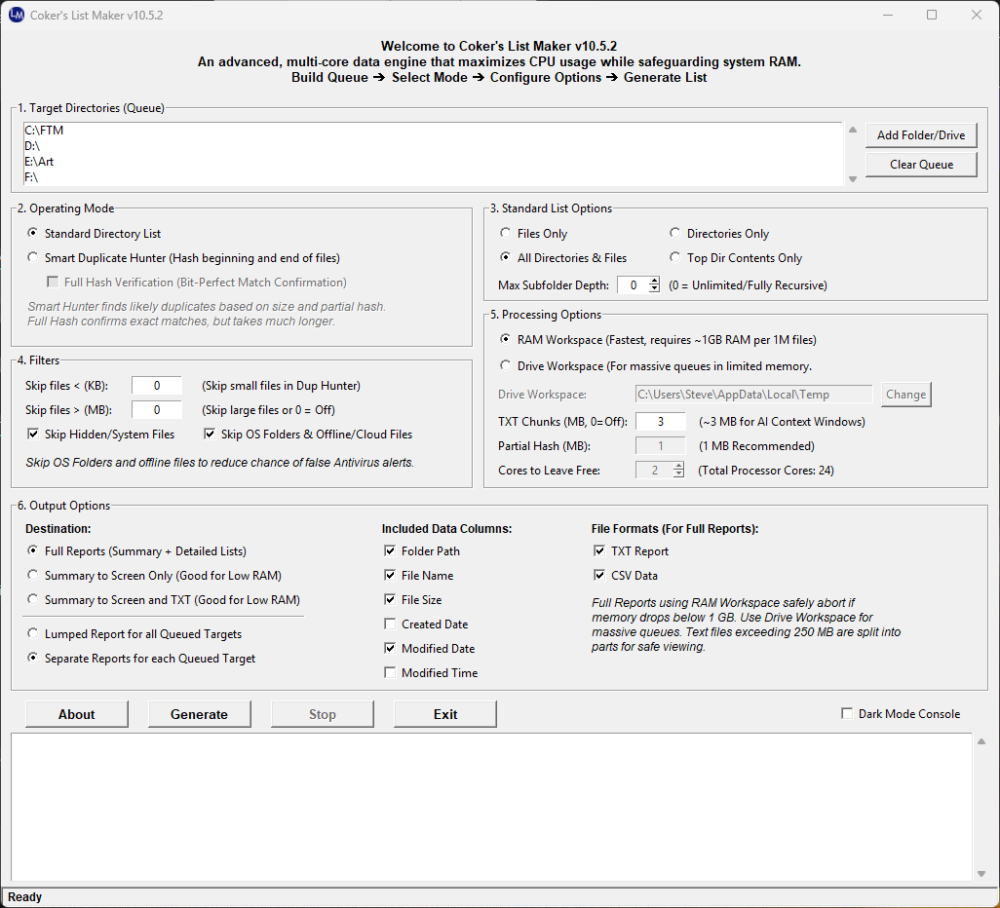

# Coker's List Maker (v10.5.2)

An advanced, multi-core ETL (Extract, Transform, Load) engine designed for forensic-level directory scanning, data analysis, and intelligent duplicate hunting. 

Originally conceived as a command-line script in 1993 by Steven James Coker, this v10.5 release features a modern GUI and a dual-core processing engine (In-Memory RAM Workspace + SQLite Disk Workspace) developed in collaboration with Google's AI in 2026.

## Key Features
* **Massive Scale:** Stress-tested to process over 6.6 million files (23+ TB of data) seamlessly.
* **Dual Processing Modes:** * *Standard Directory List:* Generates highly detailed, pipe-separated text reports and CSVs.
  * *Smart Duplicate Hunter:* Identifies redundant files using size matching and multi-threaded cryptographic hashing (Partial and Full SHA-256 verification).
* **Workspace Flexibility:** Choose between the high-speed RAM engine (requires ~1GB RAM per 1M files) or the Disk/SQLite engine for lower-memory systems.
* **Forensic Analytics:** Generates comprehensive dashboards tracking file extensions, largest files, and specifically accounting for skipped, hidden, and offline/cloud files.
* **AI-Ready Exports:** Text chunks can be safely split (e.g., ~3 MB chunks) for ingestion into large language model context windows.
* **Max Subfolder Depth Control:** Limit recursive scanning to specific levels (e.g., Top-level only or 2 levels deep).
* **Smart CSV Chunking:** Large CSV exports are now automatically split into parts to ensure compatibility with AI tool upload limits.

## Installation
Go to the [Releases](../../releases) page to download the latest `CokersListMaker_v10.5_Setup.exe` installer for Windows. 

## Support the Project
This program is **Donationware**. It is completely free for non-commercial use. If it saves you time or reclaims massive amounts of hard drive space, please consider supporting the author:
* **PayPal:** [Donate here](https://www.paypal.com/paypalme/SJCoker)
* **GoFundMe:** [Genetic Genealogy Project](https://www.gofundme.com/f/genetic-genealogy)

## License & Authorship

Free for non-commercial use. You may copy and distribute it freely. For commercial use inquiries, please contact the author (SJCoker1) via Gmail or Yahoo.
